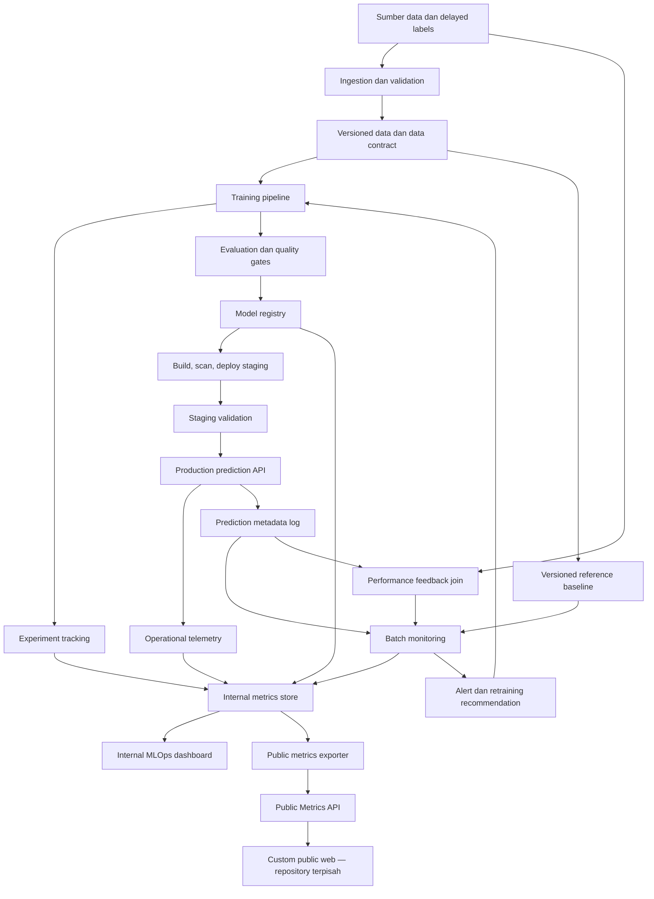
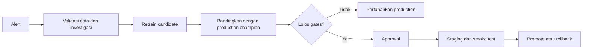

# Rancangan MLOps End-to-End — Telco Customer Churn Prediction

## 1. Status dokumen

Dokumen ini adalah rancangan teknis dan operasional untuk mengembangkan API prediksi churn yang ada menjadi sistem MLOps end-to-end berstandar industri, tetapi tetap realistis untuk proyek portofolio dengan biaya serendah mungkin.

Dokumen ini belum menjadi instruksi implementasi final. Keputusan yang sudah disepakati ditandai sebagai **keputusan**, sedangkan pilihan yang masih perlu divalidasi ditandai sebagai **belum diputuskan**. Free tier dari layanan eksternal dapat berubah, sehingga kuota dan kebijakan hosting harus diverifikasi kembali saat implementasi.

## 2. Tujuan dan batasan

### 2.1 Tujuan

Sistem yang dirancang harus mampu:

1. Memvalidasi, memversikan, dan menelusuri data yang digunakan untuk training.
2. Menjalankan training dan evaluasi secara reproducible.
3. Mencatat eksperimen serta mengelola versi model dan artefak preprocessing.
4. Menguji kandidat model sebelum dipromosikan.
5. Menyediakan API prediksi yang tervalidasi, terukur, dan dapat di-roll back.
6. Memantau data quality, data drift, prediction drift, performa layanan, dan performa model ketika label aktual tersedia.
7. Menyediakan dashboard MLOps internal untuk investigasi teknis.
8. Menyediakan Public Metrics API yang aman untuk custom web publik di repository terpisah.
9. Menjaga seluruh alur dapat dijalankan secara lokal dan menggunakan layanan gratis/free tier untuk bagian yang perlu online.

### 2.2 Di luar cakupan awal

Komponen berikut tidak menjadi prioritas fase pertama:

- Kubernetes, Kubeflow, Kafka, dan feature store terdistribusi.
- Retraining yang langsung mempromosikan model ke production tanpa approval.
- Real-time stream processing; monitoring batch sudah memadai untuk use case churn.
- Penyimpanan payload pelanggan mentah tanpa kebutuhan dan kebijakan retensi yang jelas.
- Custom web publik; web tersebut akan dibangun di repository terpisah. Repository MLOps hanya menyediakan kontrak API publiknya.

## 3. Kondisi sistem saat ini

Sistem saat ini terdiri dari:

- `model_final.joblib`: Voting Ensemble LightGBM, XGBoost, dan Logistic Regression.
- `preprocessor.joblib`: pipeline preprocessing custom.
- `handler.py`: pemuatan artefak, parsing payload, preprocessing, inferensi, threshold, dan respons.
- `main.py`: FastAPI untuk health/status sederhana dan endpoint prediksi.
- `Dockerfile`: image deployment Python 3.10.
- Threshold keputusan aktif: `0.6238`.

Fondasi serving sudah tersedia, tetapi lifecycle data, reproducible training, experiment tracking, registry, automated testing, deployment promotion, monitoring, dan governance belum dipisahkan sebagai subsistem yang eksplisit.

## 4. Prinsip arsitektur

1. **Satu versi model adalah satu paket lengkap.** Model, preprocessor, schema input, daftar fitur, threshold, baseline monitoring, metrik evaluasi, dan metadata training harus memiliki identitas versi yang sama.
2. **Training-serving parity.** Kode transformasi untuk training dan inference berasal dari implementasi yang sama.
3. **Immutable artifacts.** Artefak model yang sudah dirilis tidak ditimpa; perbaikan menghasilkan versi baru.
4. **Promotion, bukan overwrite.** Kandidat berpindah dari candidate ke staging lalu production melalui evaluasi dan approval.
5. **Monitoring bukan satu angka.** Data quality, data drift, prediction drift, service health, dan performance decay adalah sinyal berbeda.
6. **Drift bukan bukti kegagalan model.** Drift memicu investigasi; penurunan performa aktual memerlukan label aktual.
7. **Public by aggregation.** Sistem publik hanya menerima data terkurasi dan agregat, bukan akses langsung ke tools atau database internal.
8. **Local-first, cloud-optional.** Seluruh stack inti harus dapat didemonstrasikan lokal dengan container; layanan online hanya untuk API dan visualisasi publik yang memang perlu diakses.
9. **Secure by default.** Secret tidak disimpan di Git, endpoint internal tidak diekspos tanpa alasan, dan data pelanggan diminimalkan.

## 5. Arsitektur tingkat tinggi



## 6. Pemisahan repository

### 6.1 Repository MLOps ini

Repository ini menjadi sumber kebenaran untuk:

- source code training dan preprocessing;
- data contract dan validasi;
- konfigurasi eksperimen;
- evaluasi serta promotion gates;
- model serving API;
- monitoring jobs dan statistical tests;
- skema penyimpanan metrics;
- dashboard internal bila dibutuhkan;
- Public Metrics API;
- Docker dan CI/CD;
- dokumentasi model, runbook, dan arsitektur.

Struktur konseptual yang disarankan:

```text
deployment/
├── src/
│   ├── api/
│   ├── training/
│   ├── preprocessing/
│   ├── evaluation/
│   ├── monitoring/
│   └── public_metrics/
├── configs/
├── contracts/
├── tests/
│   ├── unit/
│   ├── integration/
│   ├── data/
│   ├── model/
│   └── api/
├── pipelines/
├── migrations/
├── monitoring/
│   ├── baselines/
│   └── reports/
├── docs/
├── Dockerfile
├── compose.yaml
├── dvc.yaml
└── pyproject.toml
```

Struktur ini adalah target, bukan instruksi untuk memindahkan file saat ini secara sekaligus.

### 6.2 Repository custom public web

Repository web publik hanya bertanggung jawab atas:

- UI/UX dan visualisasi;
- request read-only ke Public Metrics API;
- state loading, empty, stale, dan error;
- cache sisi web bila diperlukan;
- accessibility, responsive design, dan SEO;
- dokumentasi publik tentang tujuan dan batasan model.

Repository web tidak boleh memiliki:

- credentials database internal;
- koneksi langsung ke MLflow, storage artefak, atau monitoring database;
- payload atau fitur pelanggan mentah;
- endpoint admin, retraining, promotion, atau rollback;
- secret API yang ditanam di JavaScript browser.

## 7. Stack teknologi yang direkomendasikan

| Area | Pilihan utama | Alasan |
|---|---|---|
| Source control | GitHub | Cocok untuk portfolio dan terintegrasi dengan CI/CD |
| CI/CD dan scheduler awal | GitHub Actions | Test, build, scheduled monitoring, dan deployment workflow |
| Data versioning | DVC | Menghubungkan commit kode dengan versi dataset dan baseline |
| Data contract | Pandera + Pydantic | Pandera untuk batch/tabular, Pydantic untuk request API |
| Experiment tracking | MLflow OSS | Parameter, metrik, artefak, lineage, dan model registry |
| Pipeline awal | Python entry points + GitHub Actions | Lebih ringan daripada orchestrator besar |
| Drift monitoring | Evidently OSS + SciPy | Report serta statistical tests yang dapat dijelaskan |
| Serving | FastAPI + Uvicorn | Melanjutkan arsitektur API saat ini |
| Packaging | Docker + Docker Compose | Reproducible local environment |
| Metadata/metrics storage | PostgreSQL | Penyimpanan terstruktur dan dapat di-query |
| Internal observability | Prometheus + Grafana, opsional pada fase awal | Service metrics dan dashboard teknis |
| Hosting publik | Hugging Face Spaces atau free-tier container host | API/demo publik; keputusan final setelah verifikasi batas layanan |
| Database hosted | Free-tier managed PostgreSQL, kandidat Supabase | Hanya bila persistence online diperlukan |
| Public web | React/Vite atau Next.js di repo terpisah | Keputusan frontend berada di proyek web |

Catatan: MLflow, Prometheus, dan Grafana dapat berjalan lokal melalui Docker Compose untuk demonstrasi penuh. Tidak semua komponen internal harus di-host 24/7 pada proyek portfolio.

### 7.1 Profil environment dan persistence

Untuk mencegah rancangan free-tier menjadi ambigu, sistem dibagi menjadi tiga profil:

| Profil | Tujuan | Komponen |
|---|---|---|
| Local development | Pengembangan cepat | API, PostgreSQL, MLflow, monitoring job, dan dashboard internal melalui Docker Compose |
| CI/staging | Test reproducibility dan integration | Runner sementara, isolated test database, artefak kandidat, dan smoke-test deployment |
| Public demo | Menampilkan API serta metrik portfolio | Prediction API, Public Metrics API, hosted metrics store, dan custom public web |

Container filesystem pada hosting gratis harus dianggap **ephemeral**. Model production boleh dibundel ke immutable image atau diunduh dari artifact storage pada startup, tetapi prediction logs, monitoring results, registry metadata, dan public snapshots tidak boleh hanya disimpan di filesystem container. Data yang harus bertahan menggunakan external database/artifact storage atau dipublikasikan sebagai artefak versioned.

MLflow lokal dapat memakai backend dan artifact directory lokal untuk demonstrasi. Jika CI dan service online perlu mengakses registry yang sama, MLflow memerlukan backend store serta artifact store yang persistent dan dapat diakses bersama. Keputusan untuk meng-host MLflow terus-menerus dipisahkan dari keputusan meng-host API publik; proyek tetap valid jika UI MLflow hanya dijalankan lokal sedangkan metadata terkurasi diekspor ke public metrics store.

Scheduled jobs pada platform yang dapat sleep tidak diasumsikan selalu berjalan. Jadwal monitoring awal dijalankan oleh CI scheduler atau layanan scheduler terpisah, kemudian hasilnya disimpan secara idempotent.

## 8. Data lifecycle dan versioning

### 8.1 Jenis data

Data dipisahkan secara logis menjadi:

- **Raw training data:** data sumber yang belum ditransformasi.
- **Validated dataset:** data yang lolos contract dan quality checks.
- **Training/validation/test split:** split yang memiliki seed dan identitas versi tetap.
- **Reference baseline:** statistik referensi untuk monitoring model tertentu.
- **Prediction metadata:** metadata request dan hasil prediksi yang sudah diminimalkan.
- **Delayed labels:** outcome churn aktual yang tersedia setelah periode observasi.
- **Monitoring results:** hasil quality checks, drift, dan evaluasi performa periodik.
- **Public metrics:** agregat terkurasi yang aman ditampilkan.

### 8.2 Identitas dan lineage

Setiap training run minimal mencatat:

- Git commit SHA;
- dataset version/checksum;
- data contract version;
- split seed dan strategi split;
- environment/dependency version;
- parameter model;
- feature list dan feature engineering version;
- preprocessor artifact URI/checksum;
- model artifact URI/checksum;
- threshold dan metode pemilihannya;
- evaluation metrics;
- reference baseline URI/checksum;
- timestamp dan run ID.

Setiap release juga menghasilkan `model_manifest` yang menjadi kontrak antartraining dan serving. Manifest minimal berisi seluruh versi/checksum artefak, nama class/format serialisasi, versi Python dan library penting, input/output signature, threshold, risk bands, serta baseline ID. Serving menolak startup jika manifest tidak lengkap atau checksum tidak cocok.

Joblib/pickle sensitif terhadap lokasi class dan versi library. Definisi transformer custom harus berada di module package yang stabil, bukan bergantung pada rebinding `__main__`. Dependency dikunci dan proses load artefak diuji di clean container. Untuk jangka panjang dapat dipertimbangkan format yang lebih portable, tetapi keputusan format tidak boleh mengorbankan preprocessing parity.

### 8.3 Pencegahan leakage

- Split data dilakukan sebelum transformer yang belajar dari data di-fit.
- Scaler, encoder, imputasi, dan pemilihan threshold hanya menggunakan training/validation sesuai perannya.
- Test set tidak digunakan untuk tuning atau pemilihan threshold.
- Data pelanggan yang sama tidak boleh tersebar lintas split bila tersedia pengenal pelanggan atau observasi berulang.
- Untuk data berbasis waktu, gunakan temporal split agar evaluasi menyerupai penggunaan di masa depan.

## 9. Kontrak data

### 9.1 Contract input inference

Schema request harus mendefinisikan:

- field wajib dan opsional;
- tipe data;
- domain nilai kategorikal;
- rentang nilai numerik;
- aturan lintas field, misalnya `TotalCharges` dan `tenure`;
- kebijakan unknown category;
- batas jumlah record per batch;
- versi schema.

Request invalid dikembalikan sebagai HTTP `422` untuk validasi payload, bukan respons HTTP sukses dengan `status: error`. Kesalahan server menggunakan kode `5xx`. Setiap error memiliki kode stabil yang dapat dipantau tanpa membocorkan stack trace.

### 9.2 Contract output inference

Respons minimal memuat:

- request ID;
- model version;
- schema version;
- prediction dan probability;
- threshold yang digunakan;
- risk label;
- timestamp UTC;
- hasil per record dan summary batch.

Risk label harus didefinisikan terpisah dari keputusan biner. Batas `High`, `Medium`, `Low`, dan `Safe` harus menjadi konfigurasi versioned, tidak tersebar sebagai angka literal di source code.

### 9.3 Backward compatibility

- Perubahan field yang mematahkan client menghasilkan versi API atau schema baru.
- Penambahan field respons sebaiknya additive.
- Model baru tidak otomatis mengubah kontrak request bila tidak diperlukan.
- Public Metrics API memiliki versi sendiri, terpisah dari Prediction API.

## 10. Training pipeline

Tahapan pipeline yang disarankan:

1. Resolve dataset dan config version.
2. Validasi schema dan data quality.
3. Buat split deterministik atau temporal.
4. Fit preprocessing hanya pada training set.
5. Train kandidat model.
6. Evaluasi pada validation set dan pilih threshold sesuai objective.
7. Jalankan final evaluation pada holdout test set.
8. Jalankan robustness checks dan pemeriksaan leakage.
9. Buat reference baseline dari data referensi yang disepakati.
10. Log seluruh parameter, metrik, plot, dan artefak ke MLflow.
11. Register kandidat dengan metadata lengkap.
12. Jalankan quality gates sebelum kandidat boleh masuk staging.

Pipeline harus idempotent sejauh mungkin: input, config, kode, dan seed yang sama menghasilkan artefak serta metrik yang dapat direproduksi dalam toleransi numerik yang ditentukan.

## 11. Experiment tracking dan model registry

Tahap lifecycle model:

- **Candidate:** hasil training yang belum lolos seluruh pemeriksaan.
- **Staging:** kandidat yang lolos offline gates dan sedang diuji sebagai service.
- **Production:** versi aktif yang melayani request.
- **Archived:** versi yang tidak aktif tetapi artefaknya tetap tersedia untuk audit atau rollback.

Istilah tersebut adalah state lifecycle milik sistem, bukan ketergantungan pada nama stage dari satu produk. Dalam MLflow, implementasinya dapat menggunakan registered model version, tags, dan aliases seperti `champion`/`candidate` sesuai versi MLflow yang dipilih. Dengan demikian rancangan tidak rusak jika API stage vendor berubah.

Metadata model production harus memuat `model_version`, `run_id`, `git_sha`, `dataset_version`, `schema_version`, `baseline_version`, `threshold`, dan waktu promosi.

Rollback harus mengubah referensi versi aktif ke artefak production sebelumnya. Rollback tidak melatih ulang model dan tidak mengganti isi artefak lama.

## 12. Quality gates model

Model hanya boleh dipromosikan bila:

- seluruh unit, integration, data, model, dan API tests lulus;
- schema training dan inference kompatibel;
- tidak ada NaN/inf pada output preprocessing atau probabilitas;
- `predict_proba` berada pada rentang `[0, 1]`;
- feature order dan feature count sesuai dengan model;
- metrik minimum absolut terpenuhi;
- kandidat tidak mengalami regresi melebihi toleransi terhadap model production;
- latency dan ukuran image masih berada dalam batas;
- image lolos vulnerability/dependency scan sesuai kebijakan;
- baseline monitoring berhasil dibuat;
- model card dan metadata versi lengkap.

Metrik utama untuk churn sebaiknya PR-AUC karena kelas target berpotensi tidak seimbang. Recall, precision, F1, ROC-AUC, confusion matrix, calibration, dan threshold-specific business metric tetap dicatat. Nilai gate final adalah keputusan bisnis/eksperimen dan belum ditetapkan dalam dokumen ini.

## 13. Serving dan deployment

### 13.1 Endpoint konseptual

- `GET /health/live`: proses hidup.
- `GET /health/ready`: model dan preprocessor berhasil dimuat.
- `GET /version`: versi service, model, schema, dan baseline tanpa data sensitif.
- `POST /v1/predict`: prediksi tervalidasi.
- `GET /metrics`: metrik teknis untuk scraper internal; tidak harus publik.
- `GET /public/v1/...`: Public Metrics API read-only.

Prediction API dan Public Metrics API berada dalam repository yang sama tetapi merupakan komponen logis terpisah. Fase awal boleh menjalankannya dalam satu deployment untuk menghemat biaya, selama router, izin database, schema, rate limit, dan logging dipisahkan. Jika traffic atau risiko meningkat, keduanya dapat dideploy sebagai service berbeda tanpa mengubah kontrak custom web.

Liveness tidak boleh bergantung pada database eksternal. Readiness boleh gagal jika model belum dapat digunakan. Ini mencegah service dianggap mati hanya karena dependency monitoring sedang terganggu, sekaligus mencegah traffic masuk sebelum model siap.

### 13.2 Deployment flow

1. Pull request menjalankan lint, tests, dan pemeriksaan keamanan.
2. Merge ke branch utama membangun image immutable dengan tag Git SHA.
3. Image dipindai dan dipublikasikan ke registry.
4. Versi candidate dideploy ke staging.
5. Staging menjalankan smoke test, contract test, dan golden prediction test.
6. Approval mempromosikan image dan model version yang sama ke production.
7. Post-deployment checks memverifikasi health, latency, dan prediksi contoh.
8. Jika check gagal, rollback ke pasangan image-model sebelumnya.

Jangan menggunakan tag `latest` sebagai satu-satunya identitas production. Image dan model harus dapat ditelusuri secara independen tetapi direkam sebagai satu deployment manifest.

## 14. Logging dan observability

### 14.1 Structured logs

Log aplikasi menggunakan JSON dan minimal berisi:

- timestamp UTC;
- severity;
- request/correlation ID;
- endpoint;
- HTTP status;
- latency;
- model dan schema version;
- batch size;
- error code bila gagal.

Payload mentah, nama pelanggan, dan customer ID asli tidak dicatat secara default. Bila korelasi dengan delayed label memerlukan customer ID, simpan token/pseudonymous ID menggunakan keyed hash atau mapping pada sistem yang aksesnya terbatas. Hash biasa untuk ID berentropi rendah tidak cukup melindungi identitas.

### 14.2 Service metrics

Minimal pantau:

- request count dan rate;
- error rate per status/error code;
- latency p50, p95, dan p99;
- batch size;
- model load failure;
- invalid payload rate;
- prediction count;
- dependency/database failure;
- CPU dan memory bila tersedia.

Logging prediction metadata tidak boleh menjadi single point of failure untuk inferensi. Jika penyimpanan monitoring gagal, kebijakan awal yang disarankan adalah prediksi tetap diberikan, kegagalan dicatat, dan metric `monitoring_log_write_failure` dinaikkan. Pengecualian hanya bila regulasi mengharuskan audit log yang bersifat wajib.

## 15. Desain monitoring model

### 15.1 Empat lapisan monitoring

| Lapisan | Tujuan | Membutuhkan label aktual |
|---|---|---|
| Data quality | Menemukan invalid, missing, unknown, atau out-of-range input | Tidak |
| Data drift | Membandingkan distribusi fitur production terhadap reference baseline | Tidak |
| Prediction drift | Membandingkan probability/prediction distribution | Tidak |
| Performance decay | Mengukur kualitas prediksi terhadap outcome aktual | Ya |

Service health berada di lapisan observability, bukan pengganti model monitoring.

### 15.2 Reference baseline

Baseline awal berasal dari data training atau validation yang dianggap paling representatif terhadap populasi saat deployment. Keputusan dataset referensi final belum ditetapkan dan harus didokumentasikan per versi model.

Baseline bukan hanya file training mentah. Artefak baseline minimal memuat:

- model version dan dataset version;
- periode data dan jumlah observasi;
- definisi populasi serta filter;
- schema dan daftar fitur;
- histogram/bin edges numerik yang dibekukan;
- frekuensi kategori termasuk kategori `OTHER/UNKNOWN`;
- missing rate;
- distribusi prediction probability;
- statistik ringkas;
- metode, parameter, dan threshold drift;
- checksum dan waktu pembuatan.

Ketika model production berubah, monitoring beralih ke baseline milik versi model baru. Hasil monitoring lama tetap menunjuk baseline lama agar histori tidak berubah makna.

### 15.3 Window produksi

Monitoring menggunakan dua window:

- **Reference window:** baseline immutable milik model version.
- **Current window:** data produksi dalam rentang waktu atau jumlah observasi tertentu.

Current window berbasis jumlah observasi lebih stabil ketika traffic rendah. Fase awal dapat memakai window minimum, misalnya baru menghitung drift setelah jumlah sampel mencukupi. Nilai minimum final perlu ditentukan berdasarkan traffic; sistem harus menampilkan `insufficient_data`, bukan menganggap `stable`, bila sampel belum cukup.

### 15.4 Metode statistik

| Tipe/sinyal | Metode kandidat | Catatan |
|---|---|---|
| Numerik | PSI, KS test, Wasserstein distance | PSI mudah dikomunikasikan; KS sensitif terhadap ukuran sampel; Wasserstein memberi besar perpindahan |
| Kategorikal | Chi-square, Jensen–Shannon divergence, PSI kategorikal | Gabungkan kategori sangat jarang agar expected count memadai |
| Missingness | Difference in proportion atau proportion test | Dipantau terpisah dari distribusi nilai valid |
| Unknown category | Rate dan perubahan rate | Sinyal schema/population change |
| Prediction probability | PSI, KS, Wasserstein | Sinyal awal, bukan bukti performance decay |
| Predicted class rate | Difference in proportion | Dipengaruhi threshold dan population mix |
| Performance | PR-AUC, precision, recall, F1, calibration | Hanya setelah label aktual matang |

P-value tidak digunakan sendirian karena sangat dipengaruhi ukuran sampel. Keputusan drift menggabungkan statistical significance, effect size, sample size, dan persistensi lintas window. Jika banyak fitur diuji sekaligus, gunakan koreksi multiple testing seperti Benjamini–Hochberg atau perlakukan p-value sebagai sinyal diagnostik, bukan satu-satunya gate.

### 15.5 Raw versus transformed features

Monitoring utama dilakukan pada fitur mentah sebelum preprocessing karena lebih mudah dijelaskan dan membantu mendeteksi masalah kontrak data. Fitur hasil preprocessing dapat dipantau sebagai diagnostik internal untuk memastikan perilaku encoder/scaler, tetapi tidak menjadi bahasa utama pada dashboard publik.

Feature engineering yang penting bagi keputusan model, seperti `tc_residual`, tetap dapat dipantau sebagai engineered feature dengan lineage yang jelas terhadap input mentah.

### 15.6 Status kesehatan

- **insufficient_data:** observasi belum cukup untuk penilaian.
- **stable:** tidak ada sinyal substantif.
- **watch:** drift moderat atau anomali baru yang belum persisten.
- **warning:** drift kuat/persisten atau data quality memburuk.
- **critical:** performa aktual melewati batas kritis, kontrak data rusak, atau model tidak layak digunakan.
- **unknown:** monitoring gagal atau data tidak tersedia; berbeda dari `stable`.

Status agregat harus menyimpan alasan dan bukti. Dashboard tidak boleh hanya menampilkan warna tanpa fitur, metode, window, sample size, dan waktu pemeriksaan yang mendasarinya.

### 15.7 Penentuan threshold drift

Contoh threshold umum seperti PSI `<0.1`, `0.1–0.25`, dan `>0.25` hanya titik awal, bukan kebenaran universal. Threshold final dikalibrasi melalui:

1. Backtesting pada beberapa periode data historis.
2. Simulasi pergeseran yang realistis.
3. Pemeriksaan false-positive alert.
4. Analisis keterkaitan drift dengan perubahan performa.
5. Penetapan toleransi per fitur berdasarkan risiko bisnis.

Fitur kritis dapat memiliki threshold berbeda dari fitur pendukung. Semua threshold harus berada di configuration version, bukan hard-coded.

## 16. Performance feedback dan delayed labels

Churn aktual biasanya baru diketahui setelah observation window tertentu. Karena itu setiap prediksi harus memiliki:

- pseudonymous entity key;
- prediction timestamp;
- prediction/probability;
- model dan threshold version;
- horizon prediksi;
- label maturity date.

Evaluation job hanya memasukkan prediksi yang labelnya sudah matang. Prediksi tanpa label matang tidak dianggap negatif. Join antara prediksi dan outcome harus menghindari duplikasi, label leakage, serta perubahan definisi churn.

Performance dipantau dalam rolling window dan selalu menampilkan sample size serta label coverage. Penurunan metrik pada sampel sangat kecil menghasilkan status `insufficient_data` atau `watch`, bukan retraining otomatis.

Jika delayed labels belum tersedia pada fase portfolio, dashboard harus jujur membedakan:

- metrik offline validation/test;
- live data/prediction drift;
- live performance: `not_available`.

Tidak boleh menyebut metrik validation sebagai performa production.

## 17. Alerting dan retraining

### 17.1 Alert policy

Alert berisi:

- severity;
- model/baseline version;
- waktu dan current window;
- sample size;
- fitur atau metrik terdampak;
- metode dan hasil statistik;
- link ke report internal;
- tindakan awal yang direkomendasikan.

Alert menggunakan debounce/persistence rule agar satu window anomali tidak menciptakan alert berulang. Status `unknown` akibat job gagal memiliki alert operasional terpisah dari drift alert.

### 17.2 Retraining policy

Retraining dapat direkomendasikan ketika salah satu kondisi berikut persisten:

- performance decay melewati threshold;
- drift terjadi pada fitur penting dan dikonfirmasi berdampak;
- data baru dalam jumlah cukup tersedia;
- jadwal refresh berkala tercapai;
- perubahan schema atau definisi bisnis memerlukan model baru.

Drift tunggal tidak langsung mempromosikan model. Alurnya:



Pada fase awal, trigger boleh otomatis membuat training run atau recommendation, tetapi promotion tetap manual.

## 18. Internal metrics store

Skema konseptual minimal:

- `model_versions`: metadata model dan status lifecycle.
- `deployments`: pasangan service image dan model version per environment.
- `prediction_events`: metadata prediksi yang diminimalkan.
- `service_metrics_rollups`: latency, request, dan error agregat.
- `monitoring_runs`: window, baseline, status, dan execution metadata.
- `feature_drift_results`: hasil per fitur dan metode.
- `data_quality_results`: missing, invalid, unknown, dan range violations.
- `performance_results`: metrik dari matured labels.
- `alerts`: status alert, acknowledgement, dan resolution.
- `public_metric_snapshots`: data terkurasi untuk Public Metrics API.

Prediction logs bervolume besar tidak harus disimpan selamanya di PostgreSQL. Tentukan retensi, agregasi, dan penghapusan. Public snapshot tidak mengandung query langsung ke tabel event mentah.

## 19. Internal dashboard versus custom public web

### 19.1 Dashboard MLOps internal

Digunakan untuk investigasi dan dapat menampilkan:

- drift per fitur dan per window;
- distribusi reference versus current;
- data-quality failures;
- model comparison;
- service errors dan latency;
- alert history;
- label coverage dan performance decay;
- detail run, baseline, dan deployment version.

### 19.2 Public Metrics API

Public Metrics API adalah boundary keamanan dan kontrak data untuk repository web publik. Endpoint konseptual:

- `GET /public/v1/overview`;
- `GET /public/v1/models/current`;
- `GET /public/v1/models/history`;
- `GET /public/v1/monitoring/history`;
- `GET /public/v1/service/history`;
- `GET /public/v1/methodology`.

Respons publik hanya berasal dari `public_metric_snapshots` yang sudah disanitasi. Endpoint tidak menjalankan query arbitrer, tidak meneruskan respons MLflow/Evidently secara mentah, dan tidak memerlukan browser memegang secret.

Custom web tidak sebenarnya membaca “dashboard internal”, karena dashboard adalah lapisan presentasi dan biasanya bukan sumber data yang stabil. Custom web membaca Public Metrics API yang dibangun di atas sumber metrik yang sama dengan dashboard internal. Pemisahan ini mempertahankan maksud bahwa web mengambil data dari sistem MLOps, tanpa mengikatnya pada HTML, plugin, atau API internal suatu dashboard.

Field publik sebaiknya memuat `generated_at`, `data_window`, `status`, dan `freshness` agar web dapat membedakan data terbaru, data lama, data tidak cukup, dan monitoring gagal.

### 19.3 Public metrics exporter

Exporter berjalan setelah monitoring atau secara terjadwal:

1. Membaca metrik internal yang diizinkan.
2. Menghitung agregat dengan minimum group size.
3. Menghapus identifier, raw features, internal URI, stack trace, dan secret.
4. Menerapkan allowlist field publik.
5. Menulis snapshot atomik dengan schema version.
6. Menyimpan audit metadata proses publikasi.

Jika exporter gagal, snapshot terakhir boleh tetap dilayani dengan status `stale`. Kegagalan tidak boleh menghasilkan snapshot kosong yang tampak seperti kondisi sehat.

## 20. Keamanan, privasi, dan governance

- Secret dikelola melalui environment/secret store dan tidak di-commit.
- CORS Prediction API dan Public Metrics API dikonfigurasi per origin, bukan wildcard production.
- Public API read-only, rate-limited, dan menggunakan response caching.
- Internal tools tidak diekspos publik kecuali dilindungi autentikasi.
- Database memakai least-privilege roles; public API hanya dapat membaca public snapshots.
- Model artifact diverifikasi checksum sebelum dimuat.
- Dependency dan container image dipindai di CI.
- Sensitive logs disaring dan memiliki kebijakan retensi.
- Model card mencatat tujuan, populasi, data, metrik, keterbatasan, risiko, threshold, dan penggunaan yang tidak disarankan.
- Audit trail mencatat siapa/kapan model dipromosikan atau di-roll back.
- Timestamp disimpan sebagai UTC; UI boleh mengonversi ke zona waktu pengguna.

Karena ini model churn, hasil prediksi sebaiknya diperlakukan sebagai rekomendasi prioritas intervensi, bukan keputusan otomatis yang merugikan pelanggan. Analisis fairness per kelompok hanya dilakukan bila atribut yang sah dan relevan tersedia serta penggunaannya diperbolehkan.

### 20.1 Kejujuran data portfolio

Jika belum ada traffic dan outcome production nyata, sistem boleh memakai replay data test atau synthetic/demo traffic untuk membuktikan monitoring pipeline. Semua output tersebut harus diberi field `data_origin` seperti `offline_test`, `replayed`, `synthetic`, atau `production`. Dashboard publik wajib menampilkan label yang sesuai dan tidak boleh menyebut metrik simulasi sebagai live production performance.

Dataset demo tidak boleh mencampur split test ke proses retraining. Replay untuk observability dipisahkan dari data evaluasi resmi agar visualisasi dashboard tidak menyebabkan leakage atau mengubah klaim performa model.

## 21. Strategi testing

### 21.1 Unit tests

- setiap custom transformer;
- parsing input;
- threshold dan risk-band mapping;
- drift calculations;
- public field sanitizer;
- status aggregation.

### 21.2 Data tests

- schema dan domain kategori;
- missingness dan duplicate constraints;
- range dan cross-field rules;
- split leakage;
- target distribution sanity check.

### 21.3 Model tests

- deterministic golden examples;
- input feature order/count;
- probability range dan finite values;
- minimum metrics dan regression gates;
- serialization/deserialization;
- model-preprocessor compatibility;
- threshold/baseline/model version consistency.

### 21.4 API and integration tests

- valid single dan batch request;
- missing/extra/invalid fields;
- unknown category;
- malformed JSON/CSV;
- payload size limit;
- HTTP status semantics;
- database/metrics-write failure;
- health/readiness behavior;
- public API schema dan absence of sensitive fields.

### 21.5 Deployment tests

- container starts from clean image;
- model loads within time/memory budget;
- smoke prediction matches expected tolerance;
- migration compatibility;
- rollback drill;
- dashboard/public client contract test.

## 22. CI/CD workflow

Workflow yang disarankan:

### Pull request

- lint dan formatting check;
- unit, data, model, dan API tests yang ringan;
- dependency/security scan;
- build container test;
- contract compatibility check.

### Main branch

- build immutable image;
- publish image dengan Git SHA;
- deploy staging;
- smoke dan integration test;
- simpan deployment manifest.

### Model training workflow

- manual dispatch, schedule, atau retraining recommendation;
- resolve data version;
- train dan log ke MLflow;
- evaluasi gates;
- register candidate;
- menunggu approval untuk staging/production.

### Monitoring workflow

- schedule berdasarkan volume/interval;
- verifikasi minimum sample dan baseline version;
- jalankan quality, drift, dan performance jobs;
- simpan hasil secara idempotent;
- update alert;
- publish public snapshot jika valid.

Job terjadwal menggunakan unique key seperti `(model_version, window_start, window_end, job_type)` agar retry tidak membuat data ganda.

## 23. Failure modes dan perilaku yang diharapkan

| Kegagalan | Perilaku |
|---|---|
| Model/preprocessor tidak dapat dimuat | Readiness gagal; service tidak menerima traffic |
| Prediction payload invalid | HTTP 422 dengan error code yang aman |
| Metrics database gagal | Prediksi tetap berjalan; failure metric/log dicatat |
| Monitoring job gagal | Status `unknown`; snapshot lama ditandai stale |
| Sampel drift terlalu kecil | Status `insufficient_data`, bukan stable |
| Baseline tidak cocok dengan model | Monitoring dibatalkan dan alert konfigurasi dibuat |
| Delayed label belum matang | Dikeluarkan dari performance calculation |
| Kandidat gagal gate | Tidak dipromosikan; production tetap aktif |
| Deployment baru gagal smoke test | Rollback ke manifest sebelumnya |
| Public exporter gagal sanitasi/schema | Snapshot baru tidak dipublikasikan |
| Hosting free tier sleep/cold start | Ditampilkan sebagai keterbatasan demo dan dipisahkan dari model health |
| Container public di-restart | Artefak dimuat ulang dari image/storage; data persistent tetap tersedia eksternal |
| Artefak dan runtime tidak kompatibel | Readiness gagal; manifest/version error dilaporkan tanpa menerima traffic |
| Data dashboard berasal dari simulasi | Respons dan UI diberi label `synthetic`/`replayed`, bukan production |

## 24. Tahapan implementasi

### Fase 1 — Fondasi dan kontrak

- restrukturisasi source code secara bertahap;
- dependency locking;
- Pydantic request/response schema;
- structured logging dan health endpoints;
- unit/API tests;
- version metadata untuk model, preprocessor, threshold, dan schema.

### Fase 2 — Reproducible training

- training pipeline;
- DVC data versioning;
- Pandera validation;
- MLflow tracking dan registry;
- quality gates dan model card;
- baseline generation.

### Fase 3 — CI/CD dan environments

- PR checks;
- immutable Docker images;
- staging deployment;
- smoke tests, approval, production promotion, dan rollback.

### Fase 4 — Monitoring

- prediction metadata store;
- batch data quality dan drift jobs;
- Evidently/SciPy reports;
- alert state machine;
- internal metrics store dan dashboard.

### Fase 5 — Performance feedback

- delayed-label contract;
- prediction-label join;
- rolling performance monitoring;
- retraining recommendations.

### Fase 6 — Public integration

- public metrics exporter;
- versioned Public Metrics API;
- sanitization/security tests;
- API contract untuk repository custom web;
- freshness, caching, rate limit, dan documentation.

## 25. Definition of Done

Rancangan dianggap terimplementasi ketika:

- commit, data, training run, model, baseline, image, dan deployment dapat ditelusuri dua arah;
- training dapat direproduksi dari versi data dan konfigurasi tertentu;
- model tidak dapat dipromosikan jika tests atau gates gagal;
- model production dapat di-roll back tanpa retraining;
- API memiliki schema, health checks, structured logs, dan metrik;
- drift tidak dihitung tanpa baseline yang cocok atau sampel cukup;
- live performance tidak diklaim tanpa matured labels;
- public web hanya mengakses Public Metrics API;
- public snapshot tidak mengandung identifier atau data sensitif;
- kegagalan monitoring tidak ditampilkan sebagai kondisi sehat;
- runbook deployment, alert investigation, retraining, dan rollback tersedia.

## 26. Keputusan yang sudah disepakati

1. Sistem dikembangkan menjadi MLOps end-to-end, bukan hanya API serving.
2. Monitoring menggunakan prinsip statistik dan baseline yang terkait dengan versi model.
3. Baseline awal kemungkinan berasal dari data training, tetapi pemilihan reference population final akan divalidasi.
4. Dashboard publik berupa custom web di repository terpisah.
5. Repository custom web hanya mengonsumsi data melalui Public Metrics API.
6. Dashboard/tools internal tidak menjadi dependency langsung browser publik.
7. Stack memprioritaskan open source dan free tier karena tujuan proyek adalah portfolio.
8. Retraining dapat diotomasi, tetapi promosi production memerlukan approval pada fase awal.

## 27. Keputusan yang masih terbuka

Sebelum implementasi, hal berikut perlu diputuskan:

1. Sumber, volume, sensitivitas, dan frekuensi data production/demo.
2. Apakah delayed labels benar-benar tersedia dan berapa maturity horizon-nya.
3. Reference population: training, validation, rolling production baseline, atau kombinasi terkontrol.
4. Window size dan minimum sample untuk setiap jenis monitoring.
5. Threshold drift per fitur dan threshold performance decay.
6. Model promotion metrics dan toleransi regresi.
7. Hosting API, PostgreSQL, dan komponen internal yang benar-benar perlu online.
8. Retensi prediction metadata dan monitoring reports.
9. Public metrics yang boleh ditampilkan serta minimum aggregation size.
10. Apakah Prediction API bersifat public demo, authenticated, atau keduanya.
11. Target SLO portfolio untuk availability, latency, dan freshness.
12. Framework serta hosting custom public web di repository terpisah.

Keputusan ini sebaiknya dicatat sebagai Architecture Decision Records agar alasan dan trade-off tetap terdokumentasi ketika desain berubah.
