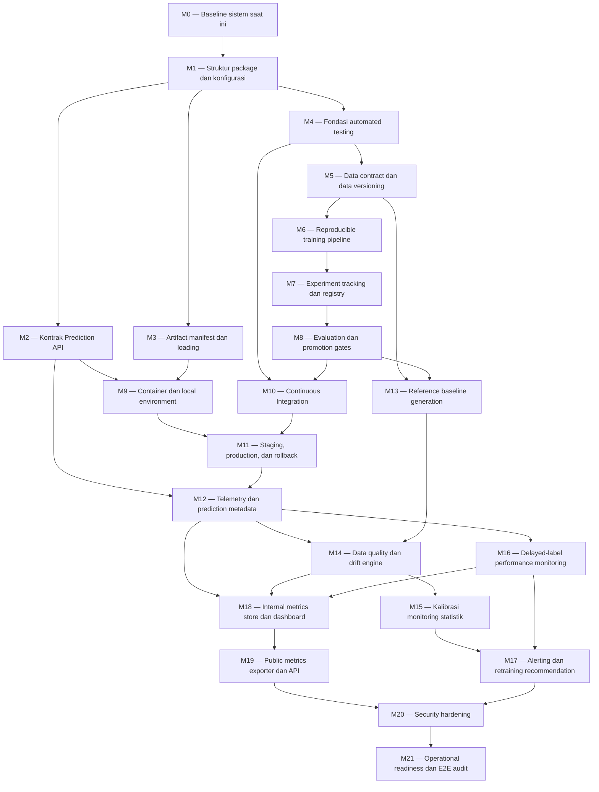

# Rancangan Implementasi MLOps — Telco Customer Churn Prediction

## 1. Tujuan dokumen

Dokumen ini menerjemahkan `MLOPS_END_TO_END_DESIGN.md` menjadi rencana implementasi berbasis milestone. Setiap milestone difokuskan pada satu area pengerjaan, menghasilkan artefak yang jelas, dan memiliki pengujian serta exit criteria yang dapat diverifikasi.

Dokumen ini adalah rencana kerja, bukan bukti bahwa komponen sudah diimplementasikan. Nilai threshold monitoring, reference population, window size, minimum sample, label maturity, dan hosting final tetap merupakan keputusan eksperimental sampai milestone kalibrasinya selesai.

## 2. Aturan pelaksanaan

### 2.1 Prinsip milestone

Setiap milestone harus memenuhi aturan berikut:

1. Hanya satu milestone berstatus `in progress` dalam satu jalur dependency utama.
2. Milestone dianggap selesai hanya setelah seluruh exit criteria terbukti.
3. Test otomatis menjadi bukti utama; screenshot atau demo manual hanya bukti tambahan.
4. Perubahan yang memengaruhi kontrak, model, baseline, atau database harus memiliki versi/migration.
5. Milestone berikutnya tidak boleh mengandalkan output yang belum lulus milestone dependency.
6. Keputusan yang belum final disimpan sebagai konfigurasi atau Architecture Decision Record, bukan angka hard-coded.
7. Setiap milestone menghasilkan dokumentasi singkat: apa yang berubah, cara menjalankan test, dan batasan yang tersisa.

### 2.2 Definisi status

- `not_started`: belum dikerjakan.
- `in_progress`: sedang dikerjakan.
- `blocked`: tidak dapat dilanjutkan karena dependency atau keputusan eksternal.
- `verification`: implementasi selesai, bukti pengujian sedang diperiksa.
- `done`: semua exit criteria lulus.

### 2.3 Bukti keberhasilan

Bukti minimum per milestone:

- commit atau pull request;
- output test otomatis;
- artefak yang dihasilkan;
- dokumentasi penggunaan;
- catatan keputusan untuk perubahan arsitektur.

## 3. Peta milestone



Beberapa milestone dapat dikerjakan paralel bila dependency-nya sudah lulus. Diagram menunjukkan dependency artefak, bukan kewajiban mengerjakan seluruh proyek secara serial.

## 4. Ringkasan milestone

| ID | Area tunggal | Hasil utama | Dependency |
|---|---|---|---|
| M0 | Baseline | Perilaku API/model saat ini terdokumentasi | Tidak ada |
| M1 | Struktur kode | Python package dan konfigurasi terpusat | M0 |
| M2 | API contract | Request/response tervalidasi dan versioned | M1 |
| M3 | Artifact contract | Manifest dan loading artefak yang aman | M1 |
| M4 | Test foundation | Test runner, fixture, dan test categories | M1 |
| M5 | Data governance | Data contract dan versioning dataset | M4 |
| M6 | Training | Pipeline training reproducible | M5 |
| M7 | Tracking/registry | Lineage eksperimen dan versi model | M6 |
| M8 | Evaluation | Quality gates kandidat model | M7 |
| M9 | Runtime | Container dan local stack reproducible | M2, M3 |
| M10 | CI | Automated checks pada pull request | M4, M8 |
| M11 | Deployment | Staging, promotion, dan rollback | M9, M10 |
| M12 | Telemetry | Structured logs dan prediction metadata | M2, M11 |
| M13 | Baseline monitoring | Reference baseline versioned | M5, M8 |
| M14 | Drift engine | Batch data quality dan drift calculation | M12, M13 |
| M15 | Drift calibration | Window, sample, metode, dan threshold tervalidasi | M14 |
| M16 | Performance | Evaluasi terhadap delayed labels | M12 |
| M17 | Response workflow | Alert dan rekomendasi retraining | M15, M16 |
| M18 | Internal visibility | Metrics store dan dashboard internal | M12, M14, M16 |
| M19 | Public integration | Public snapshot dan read-only API | M18 |
| M20 | Security | Security dan privacy hardening | M17, M19 |
| M21 | Operational readiness | Runbook dan end-to-end release drill | M20 |

## 5. Detail milestone

## M0 — Bekukan baseline sistem saat ini

### Sasaran

Mendokumentasikan perilaku model dan API saat ini sebelum refactoring sehingga perubahan berikutnya dapat dibandingkan secara objektif.

### Ruang lingkup

- Catat versi Python dan dependency yang dapat memuat artefak sekarang.
- Siapkan kumpulan input representatif: normal, boundary, batch, dan invalid.
- Simpan expected prediction/probability dengan toleransi numerik.
- Catat feature count/order setelah preprocessing.
- Catat latency dan memory hanya sebagai baseline observasi, bukan SLO final.
- Dokumentasikan keterbatasan dan bug yang sudah diketahui tanpa memperbaikinya di milestone ini.

### Deliverable

- Golden inference dataset tanpa data sensitif.
- Expected-output snapshot.
- Baseline compatibility report.
- Daftar risiko refactoring.

### Pengujian keberhasilan

1. Jalankan model saat ini pada golden dataset dua kali dalam environment yang sama.
2. Verifikasi probabilitas konsisten dalam toleransi yang ditentukan.
3. Verifikasi semua contoh valid menghasilkan jumlah output yang sama dengan jumlah input.
4. Verifikasi contoh invalid mendokumentasikan perilaku lama secara akurat.

### Exit criteria

- Golden dataset dan output dapat dibaca test runner.
- Tidak ada data pelanggan nyata atau secret dalam fixture.
- Baseline berhasil dijalankan dari clean environment yang terdokumentasi.
- Setiap perubahan prediksi di milestone berikutnya dapat dibandingkan terhadap snapshot ini.

### Di luar milestone

- Mengubah API atau model.
- Memperbaiki error semantics.
- Menetapkan target performa production.

## M1 — Struktur Python package dan konfigurasi terpusat

### Sasaran

Memisahkan source code berdasarkan tanggung jawab dan menghilangkan konfigurasi penting yang tersebar.

### Ruang lingkup

- Bentuk package untuk API, preprocessing, training, evaluation, monitoring, dan public metrics.
- Pindahkan konstanta threshold, risk bands, daftar fitur, dan environment settings ke konfigurasi tervalidasi.
- Pisahkan kode aplikasi dari entry point.
- Tambahkan dependency locking dan konfigurasi tooling.
- Gunakan module path stabil untuk transformer custom.

### Deliverable

- Struktur package target.
- Settings loader dengan nilai default development.
- Dependency lock atau versi dependency yang deterministik.
- Import graph yang tidak bergantung pada `__main__`.

### Pengujian keberhasilan

1. Import seluruh module dari root repository tanpa side effect memuat model.
2. Jalankan static import test pada clean environment.
3. Override konfigurasi melalui environment variables dan verifikasi validasi.
4. Pastikan konfigurasi invalid gagal saat startup dengan pesan yang jelas.

### Exit criteria

- Tidak ada circular import.
- Tidak ada threshold/risk-band production yang diduplikasi di beberapa module.
- Import module tidak otomatis menjalankan server atau training.
- Golden prediction M0 tetap cocok atau perbedaannya dijelaskan dan disetujui.

## M2 — Kontrak Prediction API

### Sasaran

Membuat Prediction API memiliki schema, semantik HTTP, dan versioning yang eksplisit.

### Ruang lingkup

- Definisikan Pydantic request dan response models.
- Tambahkan `/health/live`, `/health/ready`, `/version`, dan `/v1/predict`.
- Terapkan batas batch dan payload.
- Definisikan error code stabil.
- Sertakan request ID, model version, schema version, threshold, dan timestamp UTC.
- Pisahkan risk label dari binary decision.

### Deliverable

- API contract version 1.
- OpenAPI schema.
- Error catalogue.
- Contoh request/response valid dan invalid.

### Pengujian keberhasilan

1. Valid single dan batch request menghasilkan HTTP `200` dengan schema sesuai.
2. Missing field, tipe salah, dan kategori invalid menghasilkan HTTP `422`.
3. Internal exception menghasilkan `5xx` tanpa stack trace pada respons.
4. Batch melebihi batas ditolak secara deterministik.
5. `/health/live` tetap sukses saat database monitoring tidak tersedia.
6. `/health/ready` gagal saat model tidak dapat digunakan.
7. Generated OpenAPI lulus schema snapshot test.

### Exit criteria

- Semua endpoint memiliki kontrak dan tests.
- `allow_origins=["*"]` tidak digunakan pada konfigurasi production.
- Respons lama yang masih didukung memiliki migration/deprecation note.
- Golden prediction M0 tetap cocok dalam toleransi.

## M3 — Artifact manifest dan model loading

### Sasaran

Menjamin model, preprocessor, threshold, schema, dan baseline diperlakukan sebagai satu release yang kompatibel.

### Ruang lingkup

- Definisikan schema `model_manifest`.
- Catat checksum, runtime version, input signature, feature order, threshold, risk bands, dan baseline ID.
- Implementasikan loader yang memverifikasi manifest sebelum readiness sukses.
- Hilangkan ketergantungan deserialisasi pada rebinding class ke `__main__`.
- Definisikan kebijakan artefak immutable.

### Deliverable

- Manifest schema dan contoh manifest.
- Verified artifact loader.
- Compatibility matrix runtime–artifact.
- Dokumentasi proses membuat release artefak.

### Pengujian keberhasilan

1. Artefak valid berhasil dimuat di clean container.
2. Checksum salah menyebabkan readiness gagal.
3. Model dan preprocessor dari versi berbeda ditolak.
4. Feature signature tidak cocok ditolak sebelum menerima request.
5. Threshold atau manifest yang hilang menyebabkan startup failure yang terdiagnosis.
6. Serialisasi/deserialisasi round-trip mempertahankan golden predictions.

### Exit criteria

- Setiap model release memiliki manifest unik.
- Artefak production tidak ditimpa.
- Loader gagal secara aman untuk seluruh mismatch scenario.
- Tidak ada ketergantungan pada nama module `__main__`.

## M4 — Fondasi automated testing

### Sasaran

Menyediakan kerangka test yang konsisten untuk seluruh milestone berikutnya.

### Ruang lingkup

- Konfigurasikan unit, integration, data, model, dan API test markers.
- Buat fixture reusable dan isolated temporary resources.
- Tambahkan coverage report.
- Definisikan test naming dan determinism rules.
- Pisahkan fast tests dari tests yang memuat model penuh.

### Deliverable

- Test configuration.
- Shared fixtures.
- Test command per kategori.
- Minimum coverage policy awal.

### Pengujian keberhasilan

1. Seluruh fast test dapat dijalankan dengan satu command.
2. Model/integration tests dapat dijalankan terpisah.
3. Test tidak bergantung pada urutan eksekusi.
4. Test yang sama lulus dua kali berturut-turut pada clean workspace.
5. Intentional failing test menyebabkan exit code non-zero.

### Exit criteria

- Test suite dapat digunakan CI.
- Fixture tidak menulis ke production database/storage.
- Secret tidak diperlukan untuk fast tests.
- Test report dan coverage dapat dihasilkan sebagai artefak.

## M5 — Data contract dan data versioning

### Sasaran

Membuat input training dapat divalidasi, diberi versi, dan ditelusuri ke training run.

### Ruang lingkup

- Definisikan Pandera schema untuk raw dan validated dataset.
- Validasi tipe, domain kategori, missingness, duplicate, range, dan cross-field rules.
- Tambahkan DVC untuk dataset dan pipeline data.
- Definisikan dataset manifest dan checksum.
- Dokumentasikan kebijakan data sensitif dan data yang boleh masuk repository.

### Deliverable

- Versioned data contracts.
- DVC metadata/pipeline.
- Data validation report.
- Dataset version manifest.

### Pengujian keberhasilan

1. Dataset valid lulus seluruh checks.
2. Fixture dengan kolom hilang, tipe salah, kategori asing, dan range invalid gagal dengan alasan tepat.
3. Perubahan dataset menghasilkan version/checksum berbeda.
4. Commit kode dapat ditelusuri ke versi data.
5. Data raw tidak masuk Git bila kebijakannya menggunakan remote storage.

### Exit criteria

- Training tidak dapat dimulai jika data contract gagal.
- Dataset version dicatat secara deterministik.
- Schema evolution memiliki version dan compatibility note.
- Tidak ada leakage yang diketahui pada mekanisme split.

## M6 — Reproducible training pipeline

### Sasaran

Membuat training dapat dijalankan ulang dari data, kode, konfigurasi, dan seed yang terdokumentasi.

### Ruang lingkup

- Implementasikan tahap validate, split, preprocess, train, threshold selection, dan evaluate.
- Pastikan transformer hanya fit pada split yang benar.
- Definisikan config training dan seed.
- Hasilkan model, preprocessor, manifest draft, metrics, dan plots.
- Tambahkan CLI/entry point non-interaktif.

### Deliverable

- Training pipeline.
- Versioned training config.
- Reproducibility report.
- Candidate artifact bundle.

### Pengujian keberhasilan

1. Dua run dengan data/config/seed sama menghasilkan metrik dalam toleransi yang ditetapkan.
2. Perubahan seed atau parameter tercatat sebagai run berbeda.
3. Test set tidak digunakan saat fitting atau threshold selection.
4. Pipeline gagal sebelum training ketika data contract gagal.
5. Candidate bundle lengkap dan dapat dimuat oleh loader M3.

### Exit criteria

- Training selesai melalui satu command.
- Semua input dan output run memiliki version/reference.
- Tidak ada manual notebook state yang dibutuhkan.
- Reproducibility tolerance terdokumentasi.

## M7 — Experiment tracking dan model registry

### Sasaran

Mencatat lineage eksperimen dan mengelola lifecycle kandidat model.

### Ruang lingkup

- Integrasikan MLflow tracking.
- Log parameter, metrics, plots, data version, Git SHA, signature, dan artifact URIs.
- Register model versions.
- Definisikan tags/aliases untuk candidate, champion, dan archived lifecycle.
- Pisahkan registry lifecycle dari deployment state.

### Deliverable

- MLflow experiment structure.
- Registered candidate model.
- Tag/alias conventions.
- Lineage query examples.

### Pengujian keberhasilan

1. Training run M6 muncul dengan seluruh metadata wajib.
2. Model registry version menunjuk artefak dan run yang benar.
3. Missing mandatory metadata menggagalkan registration step.
4. Dua run tidak saling menimpa artefak.
5. Model dapat diambil berdasarkan immutable version, bukan hanya alias.

### Exit criteria

- Dataset, commit, run, model, dan artefak dapat ditelusuri dua arah.
- Registry state tidak disamakan dengan environment deployment.
- Metadata tetap tersedia setelah restart pada profile yang menjanjikan persistence.

## M8 — Evaluation dan promotion gates

### Sasaran

Mencegah kandidat yang tidak memenuhi standar dipromosikan.

### Ruang lingkup

- Definisikan primary dan supporting metrics.
- Tambahkan absolute gates dan regression gates terhadap champion.
- Uji probability validity, feature compatibility, robustness, calibration, dan latency.
- Hasilkan evaluation report serta model card.
- Jadikan gate config versioned.

### Deliverable

- Evaluation pipeline.
- Gate configuration.
- Candidate-versus-champion report.
- Promotion decision artifact.

### Pengujian keberhasilan

1. Kandidat baik pada fixture evaluasi lulus.
2. Kandidat dengan metrik di bawah batas gagal.
3. Kandidat dengan feature signature salah gagal.
4. NaN/inf atau probability di luar `[0,1]` gagal.
5. Kandidat yang regresi melebihi toleransi gagal walaupun training berhasil.
6. Keputusan gate dapat direproduksi dari report dan config.

### Exit criteria

- Tidak ada jalur promotion yang melewati gates.
- Nilai gate memiliki alasan dan version.
- Offline test metrics tidak diberi label production performance.

## M9 — Container dan local environment

### Sasaran

Menyediakan runtime lokal yang reproducible untuk API dan dependency inti.

### Ruang lingkup

- Buat multi-stage/minimal Docker image bila relevan.
- Tambahkan Docker Compose untuk service lokal.
- Pisahkan development dan production settings.
- Tambahkan health checks dan startup ordering.
- Dokumentasikan persistent versus ephemeral volumes.

### Deliverable

- Production Dockerfile.
- Local `compose` configuration.
- Environment template tanpa secret.
- Runtime resource baseline.

### Pengujian keberhasilan

1. Build dimulai dari clean cache dan berhasil.
2. Container memuat artefak serta menjadi ready.
3. Smoke prediction cocok dengan golden output.
4. Restart container tidak merusak persistent local metadata.
5. Container gagal readiness jika artefak invalid.
6. Image tidak memuat file data/secret yang dilarang.

### Exit criteria

- Demo lokal dapat dijalankan dari dokumentasi.
- Runtime version cocok dengan manifest.
- Image memiliki immutable tag strategy.
- Filesystem ephemeral tidak dipakai untuk data yang dijanjikan persistent.

## M10 — Continuous Integration

### Sasaran

Menjalankan quality checks otomatis pada setiap perubahan kode.

### Ruang lingkup

- Tambahkan workflow pull request.
- Jalankan lint, fast tests, model tests yang sesuai, build, dan security scan.
- Cache dependency tanpa mengorbankan reproducibility.
- Upload test, coverage, dan scan reports.
- Terapkan branch protection requirement secara konseptual/aktual sesuai akses repository.

### Deliverable

- CI workflow.
- Required check list.
- CI troubleshooting note.

### Pengujian keberhasilan

1. Pull request sehat lulus semua required checks.
2. Intentional unit failure memblokir workflow.
3. Broken Docker build memblokir workflow.
4. Data/model gate failure memblokir workflow yang relevan.
5. Secret tidak tercetak pada logs.

### Exit criteria

- Merge/promotion tidak bergantung hanya pada test manual.
- Workflow memiliki timeout dan artifact retention yang wajar.
- Free-tier minutes/storage dipantau dan heavy tests tidak dijalankan tanpa kebutuhan.

## M11 — Staging, production promotion, dan rollback

### Sasaran

Membuktikan satu release dapat dideploy ke staging, dipromosikan, dan di-roll back secara aman.

### Ruang lingkup

- Definisikan deployment manifest yang memasangkan image dan model version.
- Deploy immutable release ke staging.
- Jalankan smoke, contract, readiness, dan golden prediction tests.
- Tambahkan approval untuk production.
- Implementasikan rollback ke manifest production sebelumnya.

### Deliverable

- Deployment workflow.
- Staging environment/config.
- Deployment manifest history.
- Rollback procedure.

### Pengujian keberhasilan

1. Candidate release berhasil melewati staging checks.
2. Model/image mismatch ditolak.
3. Failed post-deploy check memicu atau merekomendasikan rollback sesuai policy.
4. Rollback mengembalikan versi dan golden behavior sebelumnya.
5. `/version` sesuai dengan deployment manifest.

### Exit criteria

- Production promotion memerlukan gates dan approval.
- Rollback drill berhasil tanpa retraining.
- Tidak mengandalkan tag `latest` sebagai identitas tunggal.
- Deployment history dapat diaudit.

## M12 — Structured telemetry dan prediction metadata

### Sasaran

Mengumpulkan informasi operasional yang diperlukan monitoring tanpa menyimpan data pelanggan secara berlebihan.

### Ruang lingkup

- Implementasikan structured JSON logs.
- Tambahkan correlation/request ID.
- Rekam latency, status, batch size, model/schema version, dan error code.
- Definisikan minimal prediction metadata schema.
- Terapkan pseudonymous entity key jika delayed-label join diperlukan.
- Buat logging failure non-blocking untuk inference sesuai policy.

### Deliverable

- Logging schema.
- Prediction event schema.
- Retention/minimization policy draft.
- Service metrics instrumentation.

### Pengujian keberhasilan

1. Request sukses dan gagal menghasilkan log terstruktur yang dapat di-parse.
2. Log tidak mengandung payload mentah, secret, atau customer ID asli.
3. Model/schema version tercatat untuk setiap prediction event.
4. Monitoring database failure tidak menggagalkan prediksi.
5. Log write failure menaikkan metric/error yang dapat dideteksi.
6. Correlation ID dapat mengikuti satu request sepanjang alur.

### Exit criteria

- Telemetry cukup untuk menghitung service health dan current distribution.
- Pseudonymization method didokumentasikan.
- Retention rule tersedia.
- Logging tidak menjadi single point of failure.

## M13 — Reference baseline generation

### Sasaran

Menghasilkan baseline monitoring immutable dan kompatibel dengan satu model version.

### Ruang lingkup

- Definisikan baseline artifact schema.
- Bangun generator statistik numerik, kategorikal, missingness, unknown rate, dan prediction distribution.
- Simpan bin edges/category policy.
- Tautkan baseline ke model, dataset, schema, dan feature-engineering version.
- Tambahkan baseline compatibility validator.

### Deliverable

- Baseline generator.
- Versioned baseline artifact.
- Baseline manifest/checksum.
- Reference population note.

### Pengujian keberhasilan

1. Input/reference data yang sama menghasilkan baseline identik.
2. Model version yang berbeda tidak dapat memakai baseline tanpa explicit compatibility.
3. Missing feature/schema mismatch menggagalkan monitoring.
4. Baseline menyimpan sample size, period, filter, dan origin.
5. Prediction baseline dibuat menggunakan model/threshold version yang benar.

### Exit criteria

- Setiap production candidate memiliki baseline.
- Baseline immutable dan dapat ditelusuri.
- Pemilihan reference population diberi status `provisional` atau `approved`.
- Baseline lama tetap tersedia setelah model baru dirilis.

## M14 — Data quality dan drift engine

### Sasaran

Menghitung data quality, data drift, dan prediction drift secara batch dengan hasil yang dapat diaudit.

### Ruang lingkup

- Implementasikan current-window resolver.
- Hitung missing, invalid, unknown, dan out-of-range rates.
- Integrasikan kandidat PSI, KS, Wasserstein, chi-square, dan Jensen–Shannon.
- Catat p-value, effect size, sample size, dan method parameters.
- Terapkan multiple-testing policy.
- Implementasikan status `stable`, `watch`, `warning`, `critical`, `insufficient_data`, dan `unknown`.

### Deliverable

- Batch monitoring job.
- Per-feature monitoring result schema.
- Machine-readable dan human-readable report.
- Idempotency key untuk monitoring runs.

### Pengujian keberhasilan

Gunakan dataset sintetis terkontrol:

1. Distribusi identik menghasilkan tidak ada drift substantif dalam toleransi statistik.
2. Mean/scale numerik yang digeser terdeteksi oleh metode yang sesuai.
3. Proporsi kategori yang digeser terdeteksi.
4. Missingness dan unknown category meningkat menghasilkan data-quality alert.
5. Sampel di bawah minimum menghasilkan `insufficient_data`.
6. Job/baseline failure menghasilkan `unknown`, bukan `stable`.
7. Retry window yang sama tidak membuat monitoring run ganda.
8. Semua hasil mencatat baseline/model/config version.

### Exit criteria

- Engine dapat membedakan data quality, feature drift, dan prediction drift.
- P-value bukan satu-satunya penentu status.
- Raw features menjadi monitoring utama; transformed features hanya diagnostik.
- Threshold masih boleh provisional sampai M15.

## M15 — Kalibrasi monitoring statistik

### Sasaran

Menentukan konfigurasi monitoring awal berdasarkan eksperimen, bukan default tanpa validasi.

### Ruang lingkup

- Backtest beberapa reference/current windows.
- Simulasikan tingkat drift numerik, kategorikal, missingness, dan prediction shift.
- Evaluasi sensitivity, false-positive rate, dan detection delay.
- Tentukan minimum samples, window policy, metode per fitur, threshold, dan persistence rule.
- Dokumentasikan fitur kritis serta alasan pembobotannya bila digunakan.

### Deliverable

- Calibration experiment suite.
- Calibration report.
- Versioned monitoring configuration.
- ADR untuk baseline/window/threshold awal.

### Pengujian keberhasilan

1. Konfigurasi mendeteksi skenario drift yang dianggap material.
2. Stable historical/synthetic windows tidak menghasilkan alert berlebihan terhadap target yang ditetapkan.
3. Minimum-sample behavior terbukti melalui boundary tests.
4. Multiple-testing correction diuji pada banyak fitur.
5. Perubahan konfigurasi menghasilkan `monitoring_config_version` baru.
6. Hasil dapat direproduksi dengan seed/data/config sama.

### Exit criteria

- Tidak ada threshold `null` pada konfigurasi yang dipakai production monitoring.
- Setiap threshold memiliki evidence atau alasan eksplisit.
- Baseline memiliki status approved untuk model terkait.
- Keterbatasan kalibrasi dicatat, terutama bila hanya memakai data sintetis.

## M16 — Delayed-label performance monitoring

### Sasaran

Mengukur performance decay hanya dari prediksi yang label aktualnya sudah matang.

### Ruang lingkup

- Definisikan delayed-label contract dan maturity horizon.
- Implementasikan idempotent prediction-label join.
- Hitung label coverage dan unmatched records.
- Hitung PR-AUC, ROC-AUC, precision, recall, F1, confusion matrix, dan calibration pada rolling window.
- Pisahkan offline metrics, replay metrics, dan production performance.

### Deliverable

- Label ingestion/join job.
- Performance result schema.
- Rolling evaluation report.
- Data-origin labeling.

### Pengujian keberhasilan

1. Label yang belum matang tidak masuk perhitungan.
2. Duplicate labels/predictions tidak menggandakan sample.
3. Model dan threshold version yang benar digunakan pada setiap evaluasi.
4. Known synthetic labels menghasilkan metrik yang sudah dihitung secara manual pada fixture.
5. Sampel/coverage rendah menghasilkan `insufficient_data`.
6. Tanpa labels, status `not_available`, bukan `stable` atau nol.

### Exit criteria

- Live performance tidak ditampilkan tanpa matured labels.
- Maturity horizon dan churn definition memiliki version.
- Label coverage selalu menyertai metrik.
- Pipeline dapat membedakan `offline_test`, `replayed`, `synthetic`, dan `production`.

## M17 — Alerting dan retraining recommendation

### Sasaran

Mengubah hasil monitoring menjadi alert yang dapat ditindaklanjuti tanpa otomatis mengganti model production.

### Ruang lingkup

- Definisikan severity dan state machine alert.
- Implementasikan persistence/debounce/deduplication.
- Pisahkan alert operasional, data quality, drift, dan performance.
- Buat retraining recommendation berdasarkan policy.
- Tambahkan acknowledgement dan resolution metadata.

### Deliverable

- Alert policy/configuration.
- Alert state machine.
- Retraining recommendation record.
- Investigation checklist.

### Pengujian keberhasilan

1. Satu warning window tidak membuat alert berulang tanpa policy.
2. Persisten drift menaikkan severity sesuai aturan.
3. Monitoring job failure menghasilkan operational alert, bukan drift alert.
4. Performance critical dapat membuat retraining recommendation.
5. Drift tunggal tidak mempromosikan model.
6. Alert resolved dapat ditelusuri ke bukti dan actor/timestamp.

### Exit criteria

- Alert memiliki reason, window, sample, model, baseline, dan config version.
- Retraining recommendation tidak sama dengan promotion approval.
- Noise control terbukti pada replay test.
- Runbook investigasi tersedia.

## M18 — Internal metrics store dan dashboard MLOps

### Sasaran

Menyediakan sumber data internal yang konsisten dan tampilan investigasi teknis.

### Ruang lingkup

- Implementasikan schema/migrations untuk model, deployment, telemetry rollups, monitoring, performance, alert, dan public snapshots.
- Terapkan unique constraints dan retention policy.
- Bangun dashboard internal untuk distribusi, drift, service health, label coverage, dan alert history.
- Pastikan dashboard menampilkan sample size, window, method, version, dan freshness.

### Deliverable

- Database migrations.
- Internal metrics queries/views.
- Internal dashboard.
- Backup/retention note untuk profile yang digunakan.

### Pengujian keberhasilan

1. Migration up berhasil pada database kosong.
2. Retry ingestion tidak menciptakan duplikasi.
3. Dashboard membedakan `stable`, `unknown`, `insufficient_data`, dan `not_available`.
4. Dashboard menampilkan baseline/current distribution yang sesuai fixture.
5. Query internal tidak mengubah data sumber.
6. Retention job tidak menghapus model/deployment audit trail yang masih wajib.

### Exit criteria

- Internal metrics store menjadi sumber kebenaran monitoring.
- Dashboard tidak diperlukan agar monitoring job dapat berjalan.
- Failure dashboard tidak mengganggu Prediction API.
- Database schema siap menjadi sumber public exporter.

## M19 — Public metrics exporter dan Public Metrics API

### Sasaran

Menyediakan kontrak read-only yang aman bagi custom web publik di repository terpisah.

### Ruang lingkup

- Definisikan allowlist field publik dan versioned schema.
- Bangun exporter yang mengagregasi serta menyanitasi internal metrics.
- Terapkan minimum group size dan data-origin label.
- Simpan snapshot secara atomik.
- Implementasikan `/public/v1` endpoints, caching, freshness, CORS, dan rate limit.
- Buat contract fixture untuk repository custom web.

### Deliverable

- Public snapshot schema.
- Exporter job.
- Public Metrics API.
- OpenAPI/JSON contract dan example payload.

### Pengujian keberhasilan

1. Snapshot hanya mengandung allowlisted fields.
2. Identifier, raw features, internal URI, secret, dan stack trace tidak muncul.
3. Exporter failure mempertahankan snapshot lama dengan status `stale`.
4. Empty/failed monitoring tidak ditampilkan sebagai `stable`.
5. Public API hanya mengizinkan operasi read-only.
6. Origin yang tidak diizinkan gagal sesuai CORS policy; rate limit dapat diuji.
7. Contract test custom web fixture lulus.
8. Data sintetis/replay memiliki label origin yang terlihat.

### Exit criteria

- Custom web tidak membutuhkan akses ke database/tool internal.
- Browser tidak memegang secret untuk membaca public data.
- API memiliki schema version dan backward-compatibility policy.
- Prediction API tetap berjalan jika exporter/public API gagal.

## M20 — Security dan privacy hardening

### Sasaran

Memastikan service, data, artefak, dan integrasi publik memenuhi security serta privacy controls yang telah dirancang.

### Ruang lingkup

- Audit secret, permissions, CORS, dependency, image, dan data exposure.
- Terapkan least-privilege database roles.
- Verifikasi public API hanya membaca public snapshots.
- Uji checksum/signature artefak dan startup failure yang aman.
- Finalisasi log redaction, pseudonymization, dan retention controls.
- Dokumentasikan threat model serta accepted risks.

### Deliverable

- Security checklist/report.
- Threat model.
- Privacy/data-flow review.
- Dependency dan container scan reports.
- Accepted-risk register.

### Pengujian keberhasilan

1. Secret scan tidak menemukan credential aktif di repository atau image.
2. Container/dependency scan tidak memiliki finding critical yang belum ditangani.
3. Database role Public Metrics API tidak dapat membaca tabel event/internal secara langsung.
4. Public endpoint tidak dapat menjalankan operasi write.
5. CORS, rate limit, payload limit, dan error redaction lulus negative tests.
6. Logs dan public snapshots lulus sensitive-field scan.
7. Artifact tampering menyebabkan readiness gagal.
8. Retention/deletion test tidak menghapus audit record yang wajib dipertahankan.

### Exit criteria

- Tidak ada critical security finding yang belum diselesaikan.
- Seluruh privilege memiliki alasan dan scope minimum.
- Sensitive-data allowlist/denylist terdokumentasi dan diuji.
- Accepted risks memiliki owner, alasan, dan rencana peninjauan.
- Security report tersedia sebagai input M21.

## M21 — Operational readiness dan end-to-end release audit

### Sasaran

Memverifikasi seluruh sistem dapat dioperasikan dan didemonstrasikan sebagai satu lifecycle MLOps end-to-end.

### Ruang lingkup

- Buat runbook deployment, monitoring failure, drift investigation, retraining, promotion, dan rollback.
- Lakukan end-to-end drill dari data version hingga public snapshot.
- Perbarui model card dan diagram arsitektur agar sesuai implementasi aktual.
- Catat known limitations, accepted risks, serta free-tier constraints.
- Susun evidence package portfolio.

### Deliverable

- Operational runbooks.
- End-to-end evidence package.
- Final model card.
- Actual-state architecture document.
- Deployment dan rollback drill records.

### Pengujian keberhasilan

End-to-end drill wajib membuktikan:

1. Dataset version dapat memicu reproducible candidate training.
2. Candidate tercatat dan melewati atau gagal gate secara benar.
3. Release dapat masuk staging dan production melalui approval.
4. Prediction menghasilkan telemetry tanpa data sensitif.
5. Monitoring memakai baseline dan config version yang cocok.
6. Drift/performance scenario menghasilkan status serta alert yang benar.
7. Public snapshot memperbarui custom-web contract tanpa membuka data internal.
8. Monitoring/public component failure tidak mematikan inference.
9. Rollback mengembalikan deployment sebelumnya.
10. Operator lain dapat mengikuti runbook tanpa pengetahuan implisit dari pembuat sistem.

### Exit criteria

- Seluruh milestone dependency berstatus `done` atau memiliki waiver terdokumentasi.
- End-to-end drill dapat diulang dari runbook.
- Arsitektur aktual cocok dengan dokumentasi.
- Tidak ada critical security finding yang belum diselesaikan.
- Portfolio membedakan secara jujur data offline, synthetic/replayed, dan production.
- Known limitations dan free-tier behavior terlihat jelas.

## 6. Test matrix lintas milestone

| Risiko | Test utama | Milestone pemilik |
|---|---|---|
| Prediksi berubah saat refactor | Golden prediction regression | M0, M1, M3 |
| Payload salah diterima | API contract tests | M2 |
| Artefak tidak kompatibel | Manifest/checksum/signature tests | M3 |
| Data training rusak | Pandera/data contract tests | M5 |
| Training tidak reproducible | Repeated seeded run | M6 |
| Lineage terputus | Registry metadata completeness | M7 |
| Kandidat buruk dipromosikan | Promotion gate negative tests | M8 |
| Container berbeda dari lokal | Clean container smoke test | M9 |
| Bug masuk branch utama | Required CI checks | M10 |
| Release gagal tanpa jalan kembali | Rollback drill | M11 |
| PII muncul di log | Log redaction tests | M12 |
| Baseline salah versi | Baseline compatibility tests | M13 |
| Drift false stable | Synthetic drift/failed-job tests | M14 |
| Threshold terlalu sensitif | Backtest dan false-positive analysis | M15 |
| Label belum matang dihitung | Label maturity tests | M16 |
| Alert spam | Debounce/deduplication tests | M17 |
| Dashboard salah membaca status | Fixture-driven UI/query tests | M18 |
| Data internal bocor ke publik | Public allowlist/negative schema tests | M19 |
| Security control tidak efektif | Secret, privilege, redaction, dan tampering tests | M20 |
| Integrasi keseluruhan rusak | End-to-end release drill | M21 |

## 7. Urutan release yang disarankan

### Release A — Reliable inference foundation

Mencakup M0–M4. Hasilnya adalah API yang perilakunya terukur, package structure yang sehat, artifact loading yang aman, dan fondasi tests.

### Release B — Reproducible model lifecycle

Mencakup M5–M8. Hasilnya adalah data dan training versioned, experiment tracking, registry, serta quality gates.

### Release C — Deployable service

Mencakup M9–M12. Hasilnya adalah runtime container, CI, staging/production flow, rollback, dan telemetry.

### Release D — Statistical monitoring

Mencakup M13–M17. Hasilnya adalah versioned baseline, drift engine, kalibrasi, delayed-label monitoring, dan alert/retraining recommendation.

### Release E — Internal and public observability

Mencakup M18–M21. Hasilnya adalah internal metrics visibility, Public Metrics API untuk custom web, security hardening, dan end-to-end operational audit.

## 8. Keputusan yang menjadi gate implementasi

Keputusan berikut tidak memblokir M0–M14, tetapi harus selesai pada milestone terkait:

| Keputusan | Batas keputusan |
|---|---|
| Reference population final | M15 |
| Current-window strategy | M15 |
| Minimum sample per test | M15 |
| Drift method dan threshold per fitur | M15 |
| Multiple-testing policy | M15 |
| Alert persistence/debounce | M17 |
| Churn definition dan label maturity | M16 |
| Performance decay threshold | M17 |
| Public metrics allowlist dan minimum group size | M19 |
| Hosted services dan free-tier provider final | Sebelum M11/M18/M19 deployment |
| Prediction API public/authenticated policy | Sebelum M11 |
| Retention policy final | M12 dan M18 |

Jika keputusan belum tersedia pada batas milestone, milestone tidak boleh ditandai `done`. Nilai sementara harus diberi label `experimental` dan tidak digunakan untuk klaim production.

## 9. Template laporan penyelesaian milestone

Setiap milestone ditutup dengan format berikut:

```markdown
# Milestone Mx Completion Report

Status: done | blocked | waiver
Tanggal:
Commit/PR:

## Deliverable
- ...

## Test evidence
- Command/workflow:
- Result:
- Artifact/link:

## Exit criteria
- [x] ...
- [x] ...

## Decisions made
- ADR/config version:

## Known limitations
- ...

## Handoff ke milestone berikutnya
- Input yang tersedia:
- Constraint yang harus dipertahankan:
```

## 10. Definition of Done program

Program implementasi dianggap selesai ketika:

1. M0–M21 memiliki completion report dan bukti test.
2. Data, commit, run, model, baseline, image, deployment, dan monitoring result dapat ditelusuri.
3. API contract, manifest, dan database schema memiliki version.
4. Model buruk atau tidak kompatibel tidak dapat dipromosikan.
5. Rollback berhasil tanpa retraining.
6. Monitoring membedakan `stable`, `watch`, `warning`, `critical`, `insufficient_data`, `unknown`, dan `not_available`.
7. Performance production tidak diklaim tanpa matured production labels.
8. Public web hanya menggunakan Public Metrics API dan tidak memiliki akses internal.
9. Data synthetic/replayed terlihat jelas sebagai data demo.
10. End-to-end drill, security audit, dan seluruh critical tests lulus.
