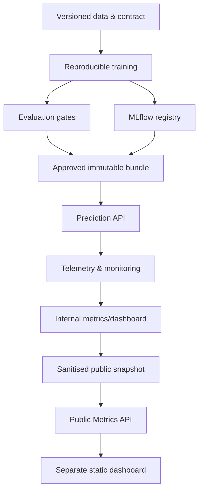

# Telco Customer Churn MLOps Platform

> A portfolio-grade, end-to-end MLOps system that evolves a legacy churn
> predictor into a reproducible, governed, observable, and privacy-aware model
> lifecycle.

## Status

**In progress — not production-ready.** Milestones **M0–M19** are completed
locally in candidate/demo mode. The final two milestones remain:

- **M20 — Security & privacy hardening**
- **M21 — Operational readiness & end-to-end release audit**

The project does not claim hosted availability, live-production performance,
or a completed security audit. Candidate, replayed, synthetic, and offline
evidence is deliberately labelled rather than presented as production health.

## The engineering story

```mermaid
flowchart LR
    A["Legacy inference model"] --> B["M0: Freeze behaviour"]
    B --> C["M1–M5: Package, API, artifacts, tests, data contract"]
    C --> D["M6–M8: Reproducible training, registry, quality gates"]
    D --> E["M9–M11: Container, CI, staged release / rollback"]
    E --> F["M12–M17: Telemetry, monitoring, alerts"]
    F --> G["M18–M19: Internal metrics + public API"]
    G --> H["M20: Security & privacy"]
    H --> I["M21: Operational readiness"]
```



The full roadmap and exit criteria are in
[MLOPS_IMPLEMENTATION_PLAN.md](MLOPS_IMPLEMENTATION_PLAN.md). For a narrative
walkthrough of the workflow and trade-offs, read
[the portfolio workflow guide](docs/portfolio-workflow.md).

## What has been built

| Capability | Implementation evidence |
| --- | --- |
| Legacy compatibility | Anonymous golden fixtures and a frozen M0 baseline protect established inference behaviour. |
| Reproducible ML | Versioned data contract, DVC lineage, pinned runtime, config-driven training, and MLflow experiment lineage. |
| Safe model release | Immutable artifact bundles, checksums, evaluation gates, model cards, promotion approval, and rollback controls. |
| Reliable serving | Versioned FastAPI schemas, health endpoints, Docker/Compose runtime, and CI policy. |
| Honest monitoring | Telemetry, data-quality/drift signals, delayed-label performance evaluation, and alert/retraining recommendations. |
| Privacy boundary | Internal aggregate metrics are separated from a snapshot-only, GET-only Public Metrics API. |

## Decisions that shape the design

| Decision | Reason |
| --- | --- |
| One immutable bundle per release | Model, preprocessor, threshold, schema, and metadata remain compatible and traceable. |
| Promotion instead of overwrite | Candidates must pass evidence gates and approval; rollback does not require retraining. |
| Local-first, cloud-optional | The system can be inspected and demonstrated without paid infrastructure. |
| Monitoring is multi-signal | Data quality, drift, service health, and delayed-label performance answer different questions. |
| Drift triggers investigation | A shifted distribution is not automatically proof of model failure. |
| Public data is aggregate snapshots | Browsers never hold internal credentials or access raw customer/prediction data. |

The durable rationale and alternatives for each major choice are kept in
[Architecture Decision Records](docs/decisions/).

## Architecture



## Repository map

```text
mlops/
├── src/telco_churn/       # MLOps package: API, training, artifacts, monitoring
├── configs/               # Versioned training, evaluation, monitoring policies
├── contracts/             # Versioned data and public API contracts
├── baseline/              # Frozen M0 fixtures and compatibility evidence
├── docker/                # Reproducible runtime definitions
├── docs/decisions/        # Architecture Decision Records
├── docs/milestones/       # Completion reports and verification evidence
├── docs/logs/             # Chronological engineering logs
├── tests/                 # Unit, contract, integration, and policy tests
└── MLOPS_IMPLEMENTATION_PLAN.md
```

## Run locally

Prerequisites: Docker Desktop and a verified M3/M6 bundle produced locally.
The runtime mounts the bundle read-only; it never embeds model artifacts in the
image.

```powershell
$env:TELCO_CHURN_IMAGE_TAG = "local"
$env:TELCO_CHURN_BUNDLE_DIR = "<absolute-path-to-bundle>"
$env:TELCO_CHURN_DECISION_THRESHOLD = "<model_manifest decision_threshold>"
$env:TELCO_CHURN_LOW_RISK_THRESHOLD = "<model_manifest risk_bands.low>"
$env:TELCO_CHURN_HIGH_RISK_THRESHOLD = "<model_manifest risk_bands.high>"
docker compose up --build --wait
```

Check `http://127.0.0.1:8000/health/ready`, then stop the runtime with:

```powershell
docker compose down
```

For exact commands and prerequisites, see
[the local runtime guide](docs/m9-local-runtime.md). The browser-facing
aggregate-data API is documented in
[M19 Public Metrics API](docs/m19-public-metrics-api.md).

## Verification

Model and artifact tests run in the locked runtime image:

```powershell
docker run --rm --mount "type=bind,source=$((Get-Location).Path),target=/workspace,readonly" `
  --workdir /workspace -e PYTHONPATH=/workspace/src `
  --entrypoint python telco-churn-m8-runtime:local scripts/run_tests.py model
```

The CI workflow is defined in `.github/workflows/ci.yml`. It is least-privilege,
uses synthetic CI artifacts, and does not publish images or deploy services.

## Roadmap

- [x] M0–M19: foundations, reproducible ML, release control, monitoring,
  internal metrics, and public aggregate evidence.
- [ ] M20: threat model, secret/permission audit, scans, redaction/retention
  verification, and privacy review.
- [ ] M21: runbooks, repeatable end-to-end release/rollback drill, and final
  portfolio evidence package.

## Responsible use

Churn prediction should support human review and retention prioritisation; it
should not automatically make harmful decisions about customers. This is an
educational portfolio project, and its demonstration evidence must not be
mistaken for a claim of production model performance.
